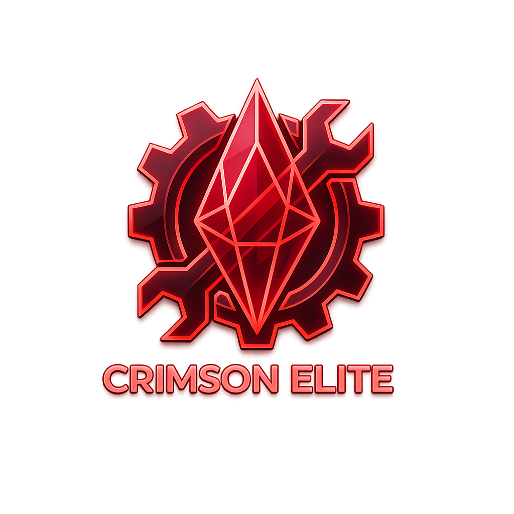

<p align="center">
  
</p>

<h1 align="center">Crimson Desert Elite BR</h1>

<p align="center">
  <b>O gerenciador de mods definitivo para Crimson Desert.</b><br>
  Todos os formatos. Interface premium. Um clique.
</p>

<p align="center">
  
  
  
</p>

---

## Como Funciona

Seus arquivos originais de jogo **nunca são modificados**. Os mods são aplicados via diretório de overlay (`CDModsElite/`). Reverter é instantâneo.

1. Baixe **CrimsonDesertEliteBR.exe** e execute — sem instalação
2. Configure o diretório do jogo na primeira inicialização
3. Arraste mods para a janela — suporte a importação em lote
4. Clique em **Aplicar**

> Se algo der errado, clique em **Reverter** para restaurar o estado limpo com um clique.

---

## Formatos Suportados

| Formato | Descrição |
|---------|-----------|
| `.zip` / `.7z` / `.rar` | Archives — extraídos e detectados automaticamente |
| Pastas | Diretórios com arquivos PAZ/PAMT ou mods do Crimson Browser |
| `.json` | Mods de byte-patch JSON (compatível com JSON Mod Manager) |
| `.dds` | Mods de textura DDS com registro completo no índice PATHC |
| `OG_*.xml` | Mods XML de substituição completa |
| `.asi` | Plugins ASI — detectados automaticamente, instalados em `bin64/` |
| `.bnk` | Mods de soundbank Wwise |
| `.bat` / `.py` | Script installers — executa em console, captura mudanças |
| `.bsdiff` / `.xdelta` | Patches binários |
| Archives mistos | ZIPs com ASI + conteúdo PAZ — separados automaticamente |

---

## Funcionalidades

### Performance
- **Importação em lote** — arraste dezenas de mods de uma vez
- **Aplicação rápida** — cache de overlay + engine nativa em Rust, aplica em segundos
- **Isolamento total** — toda a estrutura de trabalho em `CDModsElite/`, nunca sobreescrevendo `CDMods/`

### Gerenciamento de Mods
- **Composição por entrada** — múltiplos mods modificam o mesmo arquivo PAZ com segurança
- **Merge semântico** — diff por campo para 322 esquemas de tabelas PABGB
- **Detecção de conflitos** — veja exatamente o que se sobrepõe e por quê
- **Modo override** — autores de mods podem declarar vencedores de conflito via `modinfo.json`
- **Ordem de carga** — reordenação por drag-and-drop
- **Mods configuráveis** — seletor de preset para mods multi-variante, toggle por patch

### Integração com o Jogo
- **Detecção automática** — encontra o jogo na Steam, Epic Games ou Xbox Game Pass
- **Detecção de atualização** — sinaliza mods desatualizados após patches do jogo
- **Gerenciamento de ASI** — página completa de plugins com rastreamento de versão, ativar/desativar, editar config
- **Iniciar o jogo** — abra o Crimson Desert diretamente pelo gerenciador

### Interface
- **UI premium Crimson** — tema escuro com acento crimson `#C0392B`, cards animados e glassmorphism
- **Sem wizard — configuração direta** — primeira execução limpa e objetiva
- **Tema escuro como padrão** — identidade visual Elite desde o primeiro boot
- **PT-BR nativo** — toda a interface, progresso e diálogos em português brasileiro

### Segurança
- **Preview de aplicação** — veja o que muda antes de modificar qualquer coisa
- **Verificar estado do jogo** — escaneia todos os arquivos, exibe vanilla vs modded
- **Reversão com um clique** — restaura todos os arquivos incluindo PATHC e PAMTs
- **Recuperação de crash** — commits atômicos com marcadores `.pre-apply`
- **Encontrar Mod Problemático** — wizard de debug binário encontra qual mod causa crash

---

## Instalação

### Executável Standalone (Recomendado)

Baixe `CrimsonDesertEliteBR.exe` da página de Releases. Sem Python necessário. Apenas execute.

### Executar do Código-Fonte

Requer Python 3.10+.

```bash
git clone <repositório>
cd Elite_Work
pip install -e .
py -3 -m cdumm.main
```

### Compilar o Executável

```bash
pip install pyinstaller
pyinstaller cdumm.spec --noconfirm
# Saída: dist/CrimsonDesertEliteBR.exe
```

---

## Requisitos

- Windows 10 / 11
- Crimson Desert (Steam, Epic Games Store ou Xbox Game Pass)

---

## Para Autores de Mods

O Crimson Desert Elite BR suporta os seguintes campos no `modinfo.json`:

```json
{
  "name": "Meu Mod",
  "version": "1.0",
  "author": "Você",
  "description": "O que faz",
  "conflict_mode": "override",
  "target_language": "pt"
}
```

- `conflict_mode: "override"` — seu mod sempre vence conflitos, independente da ordem de carga
- `target_language` — marca o mod como localização, exibe um badge

Patches JSON suportam metadados `editable_value` para edição inline de valores no painel de configuração.

---

## Créditos Técnicos

- **Lazorr** — ferramentas de parsing e repack de PAZ
- **PhorgeForge** — formato de mod byte-patch JSON
- **993499094** — referência do formato de textura PATHC
- **callmeslinkycd** — Crimson Desert PATHC Tool
- **p1xel8ted** — análise de performance

---

## Versão

**4.0.0** — CrashByte © 2026